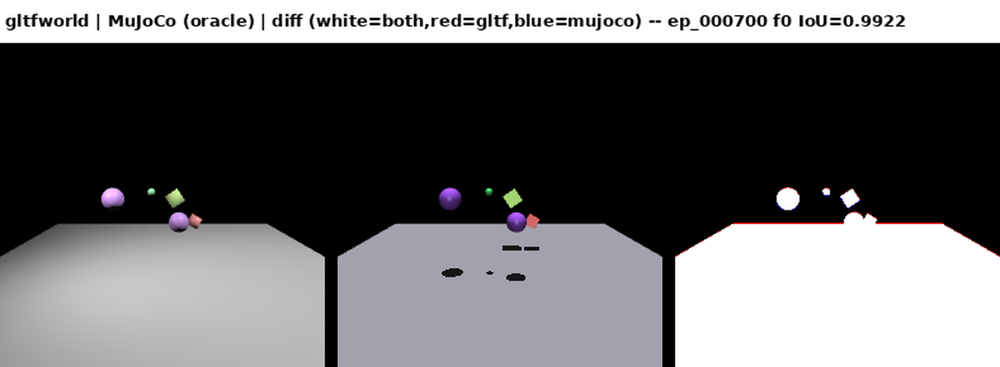
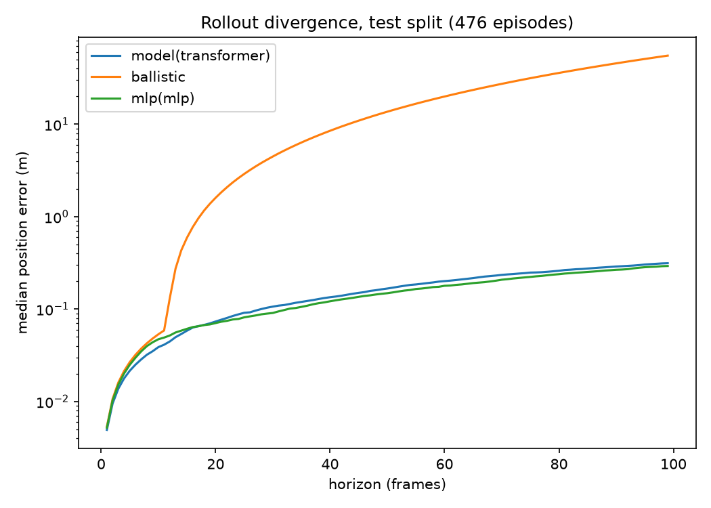
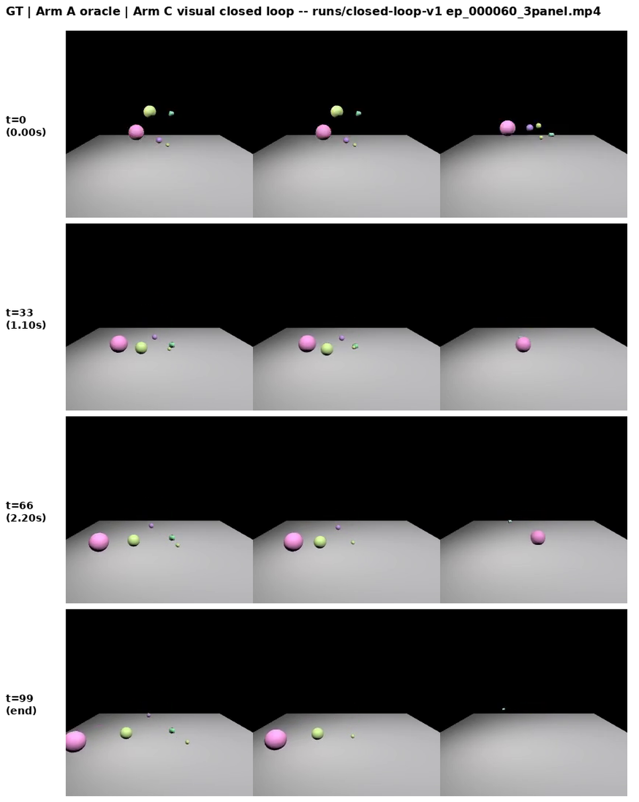
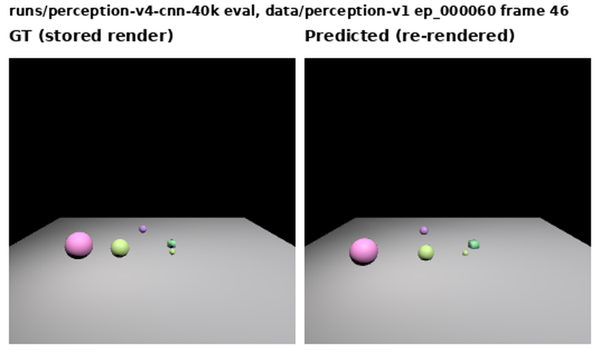
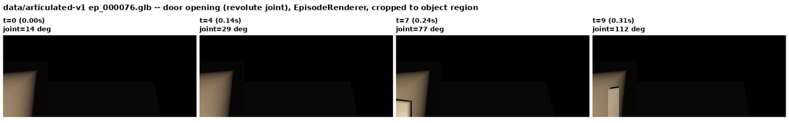
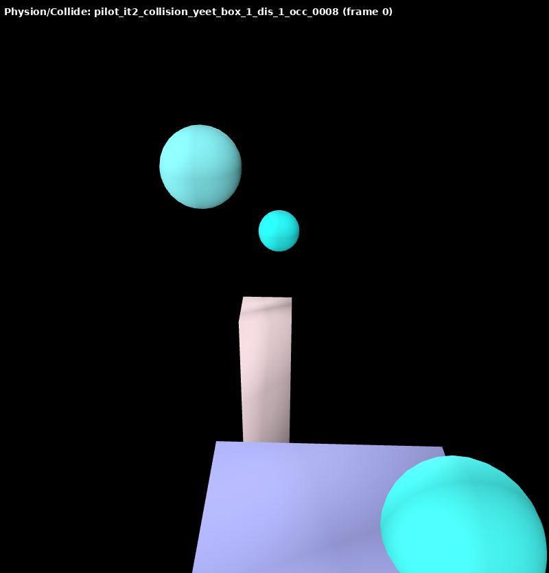
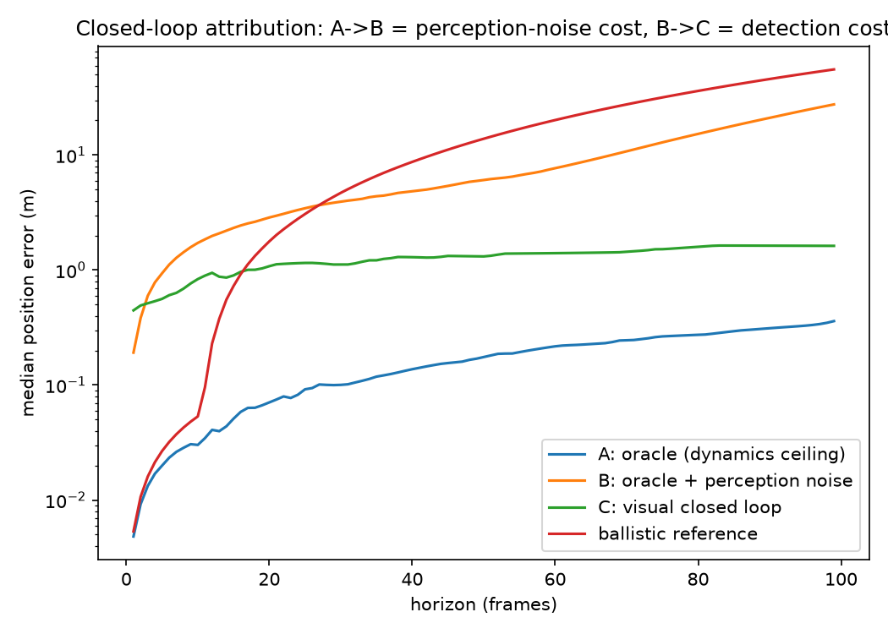

# glTF as a World-Model Transport
## Evidence-backed findings from an end-to-end ML pipeline

**Khronos 3D Formats WG presentation**
rudybear · github.com/rudybear/glTFWorldModel · MIT

*Every finding in this deck has a code pointer and a measurement in the public repo. Every image is real data from the repo's own experiments.*

---

## First: what is a "world model"? (no ML background needed)

- A **world model** is a program that predicts what happens next in a 3D scene — like a game engine's physics, except **nobody writes the rules**: the program works them out from thousands of recorded example scenes
- It has two learned parts:
  - **Perception** — looks at a rendered image and answers *"which objects are where?"*
  - **Dynamics** — given where everything is now, predicts where everything is one frame later
- **"Training"** = showing these programs tens of thousands of recorded scenes.
  **"Inference"** = running them afterward on scenes they have never seen
- Robots use exactly this to plan (*"if I push the door, what happens?"*); digital twins use it to forecast; generative 3D uses it to animate plausibly

---

## Why glTF? (yes, USD exists)

- **USD already serves much of this space** — UsdPhysics 1.0 ships in OpenUSD core, and the big robotics simulators are USD-heavy. That's fine.
- **But the demand we see comes from the glTF community**: web-first runtimes, asset pipelines, and viewers that are already glTF end-to-end — and don't want to adopt a second scene format just to carry state
- Their options today: a USD/URDF **sidecar** next to every GLB, or a **bespoke container** — both break the *"one file, opens anywhere"* property glTF is loved for
- This project asks: **what would it take for glTF itself to carry dynamic scene state?**

---

## Everyone invents a container today

- Physion (NeurIPS physics benchmark): bespoke HDF5 + MP4 + CSV
- Habitat/ReplicaCAD: **GLB for geometry + URDF sidecar** — because glTF lacks joints
- OpenUSD: UsdPhysics 1.0 in core — the mature yardstick we compare against
- No published project uses glTF as an ML scene-state transport
- Question: **how far does glTF 2.0 + draft extensions get — what exactly is missing?**
- Method: **build the whole pipeline; record every impedance mismatch**

---

## The full loop, step by step

1. A physics **simulator** produces ground-truth scenes: objects falling, colliding, doors opening
2. Every scene, at every timestep, is saved as a **GLB**: geometry + standard pose animation + draft physics extensions + our state extension
3. A **renderer** turns those GLBs into images (plus per-pixel object masks and depth)
4. The two models **train** on those images and files
5. Afterward, on scenes they have never seen: **perception** reads an image and *writes a GLB of what it sees*; **dynamics** reads that GLB and *writes a GLB of the predicted future*
6. The predicted GLB **renders like any other glTF file** — the loop closes in the format it started in

**Every arrow above is a plain, validator-clean glTF file you can drag into a viewer.**

---

## What we built (all open source, MIT)

```
MuJoCo sim ──► GLB episodes ──► headless renderer ──► rgb/seg/depth
(ground truth)  pose animation      (vendored pyrender)      │
                + KHR_physics_rigid_bodies (draft)           ▼
                + KHR_implicit_shapes (draft)      perception & dynamics
                + RWM_state_series (custom)          models (PyTorch)
                + semantics in extras                        │
                        ▲                                    ▼
                        └──── inference re-emits valid GLB ──┘
```

- 10 milestones, every one gated by **independent adversarial verification**
- 12,000+ generated episodes, 150 real Physion trials converted
- **Every emitted GLB passes the pinned Khronos glTF-Validator with 0 errors**
- Stock viewers (three.js, Babylon sandbox) play every episode — extensions ride along additively

---

## What the training data looks like


One stored training frame (`perception-v1`, episode 55): the renderer produces the color image, a per-pixel **object-identity mask**, and **depth** — all three derived from the same GLB. 400,000 frames like this were generated, all from files any glTF viewer can open.

---

## Two independent renderers, one file



The same GLB rendered by **our renderer** and by **MuJoCo** (an independent engine that never saw our code): silhouette agreement IoU **0.992**, all five objects at per-object IoU 1.000. The *file*, not shared code, carries the scene.

---

## Did the models learn? Dynamics, measured



Median position error vs. prediction horizon (log scale), held-out scenes. The learned dynamics model stays **42× closer** to the truth than physics-free constant-velocity extrapolation at 1 second, **176×** at 3.3 seconds.

---

## The closed loop, in pictures



Ground truth | rollout from a **perfect** initial state | the **full visual loop** (models only ever saw images). Every state along the way was written and re-read as a GLB.

---

## What the trained perception sees



Left: a real rendered frame. Right: the re-render of **the GLB the perception model wrote** after looking at it. Median position error 0.18 m — an honest miss vs. our 0.05 m target (colors copied from matched GT; the detector doesn't predict color).

---

## Articulation: doors that open



A hinged cabinet door opening under a scripted push (joint angle 14° → 112°), from the articulated dataset. The joint, its limits, and its per-frame angle all travel **inside the GLB** (draft KHR joints + a `joint_position` state channel). The trained joint-state estimator passed all four accuracy bars (hinge 3.35°, slider 1.45 cm, type 0.982, axis 1.84°).

---

## What glTF got RIGHT for this use (5 positive findings)

1. **Accessor/bufferView machinery is a general typed time-series transport** — our custom state channels reuse it unchanged; zero schema failures across 10k+ episodes
2. **Additive extension model works**: `extensionsUsed` (never `Required`) keeps every file loadable by tools that know nothing about physics or state
3. **Single-file GLB episodes**: atomic, diffable, validator-checkable artifacts — GT and model predictions are directly comparable documents
4. **STEP animation sampling** honestly represents sampled simulator states
5. **Fixed units & coordinate conventions** (meters, seconds, Y-up RH) eliminated a whole class of ambiguity

---

## Gap Part A — Core glTF has no concept of dynamic state

| Gap | What's missing | Our workaround |
|---|---|---|
| G1 | A **recorded-observation plane**: measured velocities, actions, uncertainty, joint measurements — everything time-varying in glTF (incl. via ratified `KHR_animation_pointer`) is *prescriptive*, applied by players | `RWM_state_series` (custom): *descriptive* channels over ordinary accessors sharing the animation's time accessor |
| G2 | Physics initial conditions (mass, friction, colliders) | draft KHR extensions (next slide) |
| G3 | Channels wider than VEC4 | documented chunking convention |
| G6 | Uncertainty representation **and semantics** | diagonal-variance channel + a measured warning (later slide) |

**Key point:** ratifying the physics extensions does **not** close G1 — a time-series extension is a *separate, complementary* need.

---

## Gap Part B — Implementing against the draft KHR physics extensions

We implemented `KHR_physics_rigid_bodies` + `KHR_implicit_shapes` (pinned draft commit) for real scenes, including articulated doors/drawers via limit-composed hinge/slider joints. Real gaps hit:

| Gap | Finding | Cost we paid |
|---|---|---|
| G7 | **No collider local offset/center** in KHR_implicit_shapes | forced a pivot-child-node design; unavoidable mesh-pivot vs collider-center error in real-asset conversion |
| G8 | Limit damping is soft-stop only — **no viscous joint damping** | articulated scenes need side-channel metadata; MJCF/URDF have this natively |

---

## Gap Part B (continued)

| Gap | Finding | Cost we paid |
|---|---|---|
| G9 | Drives model persistent spring-to-target — **no bounded-duration push** | scripted actuation not encodable as a KHR drive at all |
| G10 | **No fixed/weld joint** | handle attachment is derived, not constrained |
| G11 | Single friction model vs static+dynamic pairs | measured information loss converting Physion (e.g. 1.0 vs 0.1 collapsed) |

---

## Gap Part C — Real-world conversion evidence (Physion)

Converted 150 trials of a real NeurIPS physics benchmark (ThreeDWorld HDF5) into the transport:

- 14 documented impedance mismatches: missing normals, mesh pivot conventions, camera matrix chirality, no ground-plane object concept, dropped collision events, friction collapse…
- **Result: 150/150 validator-clean GLBs; poses/velocities bit-exact round-trip**
- State-based label reconstruction: **92% agreement** with the benchmark's own labels — the transport carries enough state to reproduce a published benchmark's ground truth
- Honest negative: our small dynamics model does **not** transfer zero-shot (chance level) — the transport works; transfer learning is future work

---

## A Physion trial, opened as glTF



Converted trial `collision_yeet_box_1_dis_1_occ_0008`, frame 0 — real benchmark geometry, poses, and camera in a validator-clean GLB. Telling finding: **the source format has no concept of lights** — an as-converted render is pitch black (light rig added at view time only). What a format doesn't standardize, someone downstream re-invents.

---

## A measured warning about uncertainty channels (G6)

Closed-loop experiment, 3 arms: oracle state / oracle + i.i.d. noise matched to measured perception error / real perception in the loop.

| arm | pos error @ h=99 |
|---|---|
| oracle state | 0.36 m |
| oracle + **i.i.d.** noise | **27.6 m** |
| **real** perception loop | **1.62 m** |

Real detector errors are **frame-correlated** (lag-1 autocorrelation 0.55–0.82) and largely cancel in finite-difference velocity estimation. An i.i.d.-calibrated uncertainty channel **overestimates closed-loop degradation 17×** — any future uncertainty extension should carry or at least warn about temporal correlation.

---

## The 17× finding, as a picture



Median position error vs. rollout horizon, per arm. The i.i.d.-noise arm — calibrated to the **correct** per-frame error magnitude — diverges past everything, while the real visual loop stays bounded. The wrong *correlation assumption*, not the wrong error size, dominates.

---

## Recommendations (ranked by measured impact × blocking severity)

1. **Ratify a KHR time-series/state extension** alongside (not inside) the physics extensions — the `{node|joint|scene}`-target + shared-time-accessor + named-channel pattern is validated here at 10k-episode scale
2. **Collider local offset in KHR_implicit_shapes** — narrowest fix, outsized payoff
3. **Joint viscous damping + bounded drive mode** — parity with MJCF/URDF for ordinary actuation
4. **Fixed/weld joint type**

---

## Recommendations (continued)

5. **Optional mesh/convex-hull collider** — the cost of its absence is measured in our real-asset conversion
6. **Best-practice guidance: per-frame uncertainty ≠ i.i.d. noise license** (measured 17× cost)
7. Second friction coefficient; root-level gravity

Explicitly *not* recommended: video-frame sequences in glTF; widening accessors past VEC4 — conventions suffice.

---

## Proposal: EXT_state_series — what it looks like

Ballot-ready draft (spec + JSON Schemas + examples): **`docs/proposals/EXT_state_series/`**

```json
"extensions": { "EXT_state_series": {
  "version": "1.0.0-draft.1", "timesAccessor": 10,
  "channels": [
    { "pointer": "/nodes/0",  "kind": "linear_velocity",  "accessor": 11, "frame": "world" },
    { "pointer": "/extensions/KHR_physics_rigid_bodies/physicsJoints/2",
      "kind": "joint_position", "accessor": 22 },
    { "pointer": "/nodes/0",  "kind": "pose_variance", "accessor": 15, "component": 0,
      "frame": "world", "temporalCorrelation": { "model": "ar1", "coefficient": 0.71 } },
    { "pointer": "/scenes/0", "kind": "action", "accessor": 17 }
  ] } }
```

One shared time accessor; channels target **any JSON-Pointer-addressable object** (resolution rules = `KHR_animation_pointer`); `kind` supplies the quantity. `extensionsUsed` only — never `Required`.

---

## The schema — and what changes for glTF

```json
// glTF.EXT_state_series.channel.schema.json (excerpt, draft 2020-12)
"pointer":  { "type": "string", "pattern": "^(/([^/~]|~0|~1)*)*$" },
"kind":     { "oneOf": [ { "enum": [ "linear_velocity", "angular_velocity",
              "applied_force", "applied_torque", "action",
              "joint_position", "joint_velocity", "pose_variance" ] },
            { "pattern": "^x-[A-Za-z0-9](?:[A-Za-z0-9_-]*[A-Za-z0-9])?$" } ] },
"accessor": { "type": "integer", "minimum": 0 },
"frame":    { "enum": ["world", "parent", "local"] },
"sampling": { "enum": ["sampled", "interpolable"], "default": "sampled" },
"temporalCorrelation": { "model": "ar1", "coefficient": 0.71 }
```

**What changes for glTF: nothing in core.** One additive root extension over accessors glTF already has; `extensionsUsed` only; today's validator reports 0 errors on these files and today's viewers are unaffected. Full root + channel schemas ship in the proposal directory.

---

## EXT_state_series — vocabulary & normative core

| kind | width | units | frame |
|---|---|---|---|
| `linear_velocity` / `angular_velocity` | VEC3 | m/s, rad/s | **required** |
| `applied_force` / `applied_torque` | VEC3 | N, N·m | **required** |
| `joint_position` / `joint_velocity` | SCALAR | rad or m (per joint type) | forbidden |
| `action` | task-defined, chunked >4 | producer-defined | forbidden |
| `pose_variance` | 7 → 2 chunks | m², unitless | required |
| `x-*` (vendor) | vendor | vendor | vendor — unknown kinds MUST be ignored |

---

## EXT_state_series — normative core

- **6 normative decoder conventions** (object inclusion, ordering-by-pointer-index, xyzw quaternions, STEP interpolation, chunk order, count==len(times)) — each one exists because a blind implementer had to guess it
- **`temporalCorrelation` (AR(1))** on uncertainty channels — the 17× i.i.d.-vs-real evidence, in-schema; absence of the field ≠ license to assume i.i.d.
- **Non-goals**: streaming, ragged event channels, video — conventions/sidecars suffice, per this project's own measured findings
- **Conformance = the blind-reimplementation protocol**, not schema validation alone — bitwise reproduction from spec + schemas + samples

---

## What we bring to a KHR track

Not just a proposal document — a working system to ratify against:

- **Reference implementation**: `gltfworld.ext.rwm`, exercised in production across 10 milestones
- **12,000+ sample assets**: validator-clean GLBs across three datasets (dynamics/perception/articulated)
- **Conformance methodology already exercised**: the blind spec-only reimplementation protocol (previous slide), reframed as this extension's own conformance test
- **Schemas ready to vendor**: root + channel JSON Schema, draft 2020-12
- **A migration path**: exact old-target → new-pointer mapping table, from a real multi-milestone vendor extension — not a green-field guess

---

## External validity: we tested ourselves

Our own verification protocol only proves we built what we said we built — so we ran two experiments checking the claims *from the outside*:

- **Blind spec-only reimplementation.** Zero source access — only `RWM_EXTENSIONS.md` + schemas + GLBs — decoded a whole episode **bitwise-identically**. It had to guess 6 conventions our docs left implicit; one was initially *wrong* (silently-wrong shapes). All 6 are now normative.
- **Clean-room reproduction from the public clone.** A fresh `git clone` + documented setup reproduced our smoke-test pass/skip counts and split sizes **digit-for-digit**, and seeded dataset generation **bit-identical** across machines.

**This is exactly what a ratification process exists to surface** — ambiguities an author can't see in their own writing. Two cheap experiments found 6 normative gaps in a spec we thought was complete. That's the argument for a real KHR track over a permanent custom extension.

---

## Everything is verifiable

- **Public repo**: github.com/rudybear/glTFWorldModel (MIT)
- `docs/GAP_REPORT.md` — all 20 gaps + 5 positives, each with code pointer, measurement, JSON exhibit, prior-art comparison (UsdPhysics / URDF / MJCF)
- `docs/VERIFICATION.md` — every claim re-runnable: exact commands + expected outputs
- Every milestone was gated by **independent adversarial verification** (the verifier famously caught our own overclaims — the corrections are visible in the docs, per project policy)
- Sample episodes: drag any generated GLB into a stock viewer — it plays

**Ask:** feedback on recommendation #1 (time-series extension scoping) and #2 (collider offset) — we'd contribute the RWM_state_series experience to a KHR-track effort.

---

# Thank you

**github.com/rudybear/glTFWorldModel**

Questions — or better: clone it and run `docs/VERIFICATION.md` against us.
