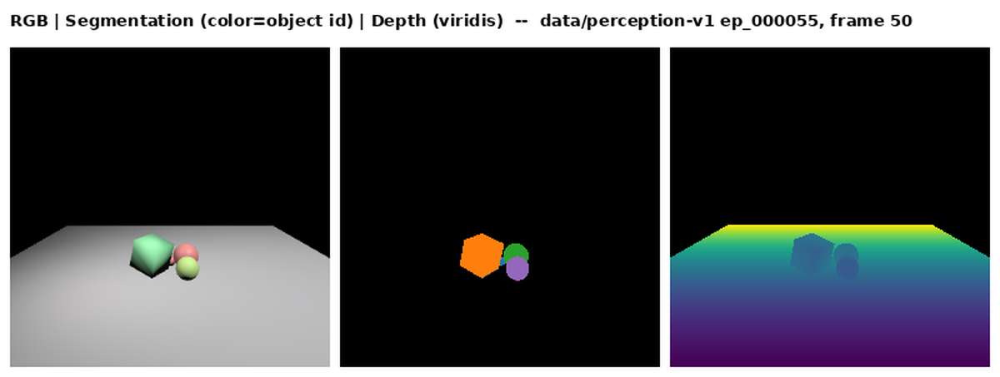

# USD & glTF as World-Model Scene Formats
## Where each stands in 2026 — and the gap both share

rudybear · github.com/rudybear/glTFWorldModel · September 2026

*Companion to the technical deck: fewer internals, wider lens. Every claim about our own experiment is measured; USD landscape claims are sourced (links on the last slide).*

---

## The problem, in plain language

- A **world model** is a program that learns to predict what happens next in a 3D scene — the engine behind robot planning, digital twins, and generative 3D
- Building one is a **relay race across tools**: a simulator makes scenes → models train on them → the trained models perceive and predict → results get rendered and evaluated
- Every hand-off needs a file that carries the **scene *and* its dynamic state**: poses over time, velocities, joints, actions, what-the-model-believes
- Today that hand-off is duct tape: bespoke HDF5 containers (Physion), GLB-plus-URDF sidecars (Habitat), USD-plus-JSON sidecars (NVIDIA's own datasets)
- Two candidates want the job: **OpenUSD** and **glTF**. We tested one and researched the other.

---

## What we did: a whole pipeline on glTF alone

We built the entire loop with **glTF as the only interchange**: physics sim → GLB episodes → renderer → trained perception & dynamics models → predictions re-emitted as GLB. 12,000+ episodes; every file validator-clean and playable in a stock viewer. Headline results: learned dynamics **42–176× better** than naive extrapolation; the full camera-to-prediction loop stays **34× better** at long horizons.

---

## What the glTF experiment taught us

- **It works — via extensions.** Standard glTF carries geometry and pose animation; draft Khronos physics extensions carry mass/friction/colliders/joints; everything else needed a custom extension we wrote (`EXT_state_series`, now a ballot-ready draft proposal)
- **glTF's superpower is distribution**: one royalty-free spec, one validator with a hard "passes ⇒ renders" guarantee, many independent implementations, opens natively in any browser
- **glTF's blind spot is *recorded* state**: animation — even via the ratified `KHR_animation_pointer`, which can time-vary any settable property — is *prescriptive*: players apply it. Measured velocities, actions, joint observations, and uncertainty need a *descriptive* channel consumers never execute — that had no home
- Cost of that blind spot, measured: 20 documented gaps, each with a workaround we had to build and validate ourselves

---

## USD in 2026: the simulation heavyweight

- **UsdPhysics is ratified and real**: anchored in the AOUSD **Core Specification 1.0** (Dec 2025) — rigid bodies, colliders, physics materials, joints *with stiffness/damping drives*, and reduced-coordinate articulations for robot arms. Ahead of glTF's still-draft physics extensions
- **The physical-AI industry runs on it**: Isaac Sim 6.0 (GA June 2026), Isaac Lab, the **Newton** physics engine 1.0 (NVIDIA + Google DeepMind + Disney, Linux Foundation, GTC 2026) — USD-native with its own schema extensions
- **SimReady** defines what a simulation-grade USD asset must contain: colliders, materials, joints, semantic labels
- **`UsdSemantics`** gives labeling a real schema — structurally stronger than glTF's free-form `extras`

---

## USD in 2026: the world-model data story — look closely

- USD: **timeSamples** put time-varying values on *any* attribute — including custom ones invented ad hoc, no schema needed
- glTF: animation + ratified `KHR_animation_pointer` time-vary any **settable** property — but all of it *prescriptively*: there is **no observation plane**, and no properties exist for actions, uncertainty, or measurements
- **But no standard says what recorded simulation state should look like.** AOUSD runs five working groups (Core Spec, Materials, Geometry, Marketing, Physics) — none for simulation state or ML data
- The revealing detail: **NVIDIA's own PhysicalAI datasets** ship USD/USDZ scenes with dynamic trajectories in **companion JSON sidecar files** — not USD timeSamples
- **Cosmos 3** (NVIDIA's world foundation model, June 2026) consumes **video + action tokens + language** — USD sits upstream (scenes get *rendered into* training video), not as the model's state format
- We found **no published ML pipeline using USD as the sim→train→inference state transport** — the same "nobody" we found for glTF

---

## Similarities: the two formats rhyme

| Both USD and glTF… | |
|---|---|
| Scene graphs with meshes, materials, cameras, animation | ✓ |
| Extension/schema mechanisms for new domains | ✓ (schemas / extensions) |
| A physics vocabulary for **initial conditions** — mass, friction, colliders, joints | ✓ (ratified vs. draft) |
| A semantics story | ✓ (`UsdSemantics` / `extras` + proposals) |
| Serve as the **asset** substrate for physical-AI data generation | ✓ |
| Are used by ML pipelines as the **state** transport between sim, training, and inference | **✗ — neither, anywhere we could find** |

The last row is the finding. Both ecosystems solved *describing a scene*; neither has standardized *recording what happened in it*.

---

## Where each is genuinely ahead

| Dimension | Advantage | Why |
|---|---|---|
| Time-varying data plumbing | **USD** | timeSamples on any attribute, incl. custom; glTF + `KHR_animation_pointer` covers *settable* properties only — recorded observations still need an extension |
| Physics maturity | **USD** | ratified Core Spec 1.0 + drives/articulations vs. glTF's drafts |
| Semantic labeling | **USD** | a real schema vs. free-form `extras` |
| Interop guarantee | **glTF** | one validator, "passes ⇒ renders"; USD validation checks schema conformance only |
| Web & runtime ubiquity | **glTF** | native browser parsing; USD's web story is WASM-based and, per AOUSD's own forum, unresolved |
| Independent implementations | **glTF** | many loaders; USD in practice = one reference SDK everyone wraps |
| Access & governance | **glTF** | royalty-free, no membership; AOUSD influence runs through paid membership |

---

## The gap both share — measured, not speculated

Neither format can natively express, for a *recorded* episode:

- **State series**: per-frame velocities, joint positions, contact events (USD: no schema, sidecar JSONs in practice; glTF: no mechanism at all until our extension)
- **Actions**: what an agent did between frames
- **Uncertainty**: what a perception model *believes*, and how that belief correlates over time — our closed-loop experiment showed the wrong correlation assumption distorts predicted reliability **17×**

Our `EXT_state_series` draft (pointer-targeted, named channels, units/frame metadata, temporal-correlation field) is one worked answer for glTF — and its channel vocabulary is format-agnostic: the same concepts would fit USD as a schema. **The two efforts could inform each other through the existing AOUSD–Khronos liaison.**

---

## Takeaways

1. **USD is the simulation industry's scene language; glTF is the web's scene currency.** For world models you want both lanes — authoring/simulation gravity vs. distribution/runtime gravity
2. **Neither is a state transport today.** The gap is identical in kind; USD's native time-sampling just makes its activation energy lower
3. **We measured the gap in glTF end-to-end** (public repo, every claim re-runnable) and drafted the missing piece; the pattern generalizes
4. Standardizing *recorded state* — in either body, ideally coordinated — would give physical AI what it currently duct-tapes: one file that carries the scene, what happened, and what the model believed

---

## Sources & links

- **Our experiment**: github.com/rudybear/glTFWorldModel — gap report, `EXT_state_series` draft, every number re-runnable (`docs/VERIFICATION.md`)
- **AOUSD Core Specification 1.0** (Dec 2025): aousd.org/news/core-spec-announcement · working groups: aousd.org/working-groups
- **UsdPhysics**: openusd.org/dev/api/usd_physics_page_front.html · **timeSamples**: openusd.org/dev/user_guides/time_and_animated_values.html
- **Isaac Sim 6.0 GA** (June 2026): github.com/isaac-sim/IsaacSim · **Newton 1.0** (GTC 2026): github.com/newton-physics/newton
- **Cosmos 3** (June 2026): arXiv:2606.02800 · **PhysicalAI datasets**: huggingface.co/nvidia (NuRec: USDZ + JSON trajectory sidecars — docs.nvidia.com/nurec)
- **SimReady**: docs.omniverse.nvidia.com/simready · **glTF-Validator**: github.khronos.org/glTF-Validator

*USD claims verified against primary sources Sept 14, 2026; absence-of-evidence findings are stated as "we found none," never "none exists."*
